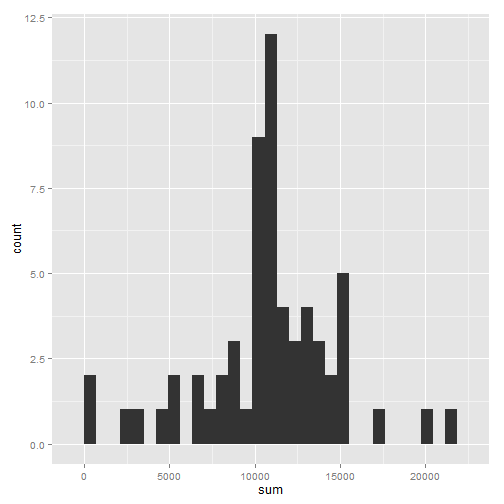

Reproducible Research: Peer Assessment 1
========================================================


## Loading and preprocessing the data

Let's start by reading the file into R. I would like to use the data.table package so let's load that as well and convert the file. We will also set the key to the date column to begin with.


```r
activity <- read.csv("activity.csv" , colClasses = c("numeric", "Date", "numeric"))

library(data.table)

activity <- data.table(activity)

setkey(activity, date)
```


## What is mean total number of steps taken per day?

Let's calculate the mean, median and sum grouped by date and store it into another variable. 


```r
act_daygrpd <- activity[,list(mean=mean(steps, na.rm=TRUE), median=as.double(median(steps)), sum= sum(steps) ), by=date]
```


I would like to use the ggplot2 package so let's load that up as well. Next we plot the histogram of the total number of steps taken each day


```r
library(ggplot2)

qplot(sum, data=act_daygrpd, geom="histogram")
```

```
## stat_bin: binwidth defaulted to range/30. Use 'binwidth = x' to adjust this.
```

 


Then return each day's mean, median and sum of steps.


```r
act_daygrpd
```

```
##           date    mean median   sum
##  1: 2012-10-01     NaN     NA    NA
##  2: 2012-10-02  0.4375      0   126
##  3: 2012-10-03 39.4167      0 11352
##  4: 2012-10-04 42.0694      0 12116
##  5: 2012-10-05 46.1597      0 13294
##  6: 2012-10-06 53.5417      0 15420
##  7: 2012-10-07 38.2465      0 11015
##  8: 2012-10-08     NaN     NA    NA
##  9: 2012-10-09 44.4826      0 12811
## 10: 2012-10-10 34.3750      0  9900
## 11: 2012-10-11 35.7778      0 10304
## 12: 2012-10-12 60.3542      0 17382
## 13: 2012-10-13 43.1458      0 12426
## 14: 2012-10-14 52.4236      0 15098
## 15: 2012-10-15 35.2049      0 10139
## 16: 2012-10-16 52.3750      0 15084
## 17: 2012-10-17 46.7083      0 13452
## 18: 2012-10-18 34.9167      0 10056
## 19: 2012-10-19 41.0729      0 11829
## 20: 2012-10-20 36.0938      0 10395
## 21: 2012-10-21 30.6285      0  8821
## 22: 2012-10-22 46.7361      0 13460
## 23: 2012-10-23 30.9653      0  8918
## 24: 2012-10-24 29.0104      0  8355
## 25: 2012-10-25  8.6528      0  2492
## 26: 2012-10-26 23.5347      0  6778
## 27: 2012-10-27 35.1354      0 10119
## 28: 2012-10-28 39.7847      0 11458
## 29: 2012-10-29 17.4236      0  5018
## 30: 2012-10-30 34.0938      0  9819
## 31: 2012-10-31 53.5208      0 15414
## 32: 2012-11-01     NaN     NA    NA
## 33: 2012-11-02 36.8056      0 10600
## 34: 2012-11-03 36.7049      0 10571
## 35: 2012-11-04     NaN     NA    NA
## 36: 2012-11-05 36.2465      0 10439
## 37: 2012-11-06 28.9375      0  8334
## 38: 2012-11-07 44.7326      0 12883
## 39: 2012-11-08 11.1771      0  3219
## 40: 2012-11-09     NaN     NA    NA
## 41: 2012-11-10     NaN     NA    NA
## 42: 2012-11-11 43.7778      0 12608
## 43: 2012-11-12 37.3785      0 10765
## 44: 2012-11-13 25.4722      0  7336
## 45: 2012-11-14     NaN     NA    NA
## 46: 2012-11-15  0.1424      0    41
## 47: 2012-11-16 18.8924      0  5441
## 48: 2012-11-17 49.7882      0 14339
## 49: 2012-11-18 52.4653      0 15110
## 50: 2012-11-19 30.6979      0  8841
## 51: 2012-11-20 15.5278      0  4472
## 52: 2012-11-21 44.3993      0 12787
## 53: 2012-11-22 70.9271      0 20427
## 54: 2012-11-23 73.5903      0 21194
## 55: 2012-11-24 50.2708      0 14478
## 56: 2012-11-25 41.0903      0 11834
## 57: 2012-11-26 38.7569      0 11162
## 58: 2012-11-27 47.3819      0 13646
## 59: 2012-11-28 35.3576      0 10183
## 60: 2012-11-29 24.4688      0  7047
## 61: 2012-11-30     NaN     NA    NA
##           date    mean median   sum
```


## What is the average daily activity pattern?

We now calculate and save the mean of the steps taken in ech interval across all days and 


```r
act_stepgrpd <- activity[,list(mean=mean(steps, na.rm=TRUE)), by=interval]
```


next we plot this as a time series. 


```r
ggplot(act_stepgrpd, aes(interval, mean)) + geom_line() + xlab("Interval") + ylab("Avg Steps across all days")
```

 


After that we return the interval with the max average of steps taken.


```r
activity[which.max(act_stepgrpd[,mean]),interval]
```

```
## [1] 835
```


## Imputing missing values

Let's find the number of NAs in the data.


```r
sum(is.na(activity[,steps]))
```

```
## [1] 2304
```

An accurate way to fill in missing values would be to take the mean of the total steps taken for that interval on those particular weekdays. For instance if interval 100 on Monday has missing values then we could fill it in with the average steps taken on all interval 100 on all Mondays to get a realistic estimate of the trend.

Since the assignment has asked for a simple strategy I am choosing to fill in the missing values with the mean of that particular interval (a missing interval 100 will be assigned mean of overall interval 100).

We make an explicit copy of the data table and fill in the missing values.


```r
actnew <- copy(activity)


fillna <- function() {
      
      for (i in seq_along(actnew[,steps])) {
            
            if (is.na(actnew[i,steps])) {
                  
                  tempint <- actnew[i, interval]
                  
                  tempr <- act_stepgrpd[interval == tempint, mean]
                  
                  actnew[i,steps := tempr]
            }
            
      }
      
}

fillna()
```

Let's calculate the mean, median and sum of each day of this new data set.


```r
actnew_daygrpd <- actnew[,list(mean=mean(steps, na.rm=TRUE), median=as.double(median(steps)), sum= sum(steps) ), by=date]
```

Next we plot the histogram of the total number of steps taken each day.


```r
qplot(sum, data=actnew_daygrpd, geom="histogram")
```

```
## stat_bin: binwidth defaulted to range/30. Use 'binwidth = x' to adjust this.
```

 

Let's return the median, mean and sum of steps for each day.


```r
actnew_daygrpd
```

```
##           date    mean median   sum
##  1: 2012-10-01 37.3826  34.11 10766
##  2: 2012-10-02  0.4375   0.00   126
##  3: 2012-10-03 39.4167   0.00 11352
##  4: 2012-10-04 42.0694   0.00 12116
##  5: 2012-10-05 46.1597   0.00 13294
##  6: 2012-10-06 53.5417   0.00 15420
##  7: 2012-10-07 38.2465   0.00 11015
##  8: 2012-10-08 37.3826  34.11 10766
##  9: 2012-10-09 44.4826   0.00 12811
## 10: 2012-10-10 34.3750   0.00  9900
## 11: 2012-10-11 35.7778   0.00 10304
## 12: 2012-10-12 60.3542   0.00 17382
## 13: 2012-10-13 43.1458   0.00 12426
## 14: 2012-10-14 52.4236   0.00 15098
## 15: 2012-10-15 35.2049   0.00 10139
## 16: 2012-10-16 52.3750   0.00 15084
## 17: 2012-10-17 46.7083   0.00 13452
## 18: 2012-10-18 34.9167   0.00 10056
## 19: 2012-10-19 41.0729   0.00 11829
## 20: 2012-10-20 36.0938   0.00 10395
## 21: 2012-10-21 30.6285   0.00  8821
## 22: 2012-10-22 46.7361   0.00 13460
## 23: 2012-10-23 30.9653   0.00  8918
## 24: 2012-10-24 29.0104   0.00  8355
## 25: 2012-10-25  8.6528   0.00  2492
## 26: 2012-10-26 23.5347   0.00  6778
## 27: 2012-10-27 35.1354   0.00 10119
## 28: 2012-10-28 39.7847   0.00 11458
## 29: 2012-10-29 17.4236   0.00  5018
## 30: 2012-10-30 34.0938   0.00  9819
## 31: 2012-10-31 53.5208   0.00 15414
## 32: 2012-11-01 37.3826  34.11 10766
## 33: 2012-11-02 36.8056   0.00 10600
## 34: 2012-11-03 36.7049   0.00 10571
## 35: 2012-11-04 37.3826  34.11 10766
## 36: 2012-11-05 36.2465   0.00 10439
## 37: 2012-11-06 28.9375   0.00  8334
## 38: 2012-11-07 44.7326   0.00 12883
## 39: 2012-11-08 11.1771   0.00  3219
## 40: 2012-11-09 37.3826  34.11 10766
## 41: 2012-11-10 37.3826  34.11 10766
## 42: 2012-11-11 43.7778   0.00 12608
## 43: 2012-11-12 37.3785   0.00 10765
## 44: 2012-11-13 25.4722   0.00  7336
## 45: 2012-11-14 37.3826  34.11 10766
## 46: 2012-11-15  0.1424   0.00    41
## 47: 2012-11-16 18.8924   0.00  5441
## 48: 2012-11-17 49.7882   0.00 14339
## 49: 2012-11-18 52.4653   0.00 15110
## 50: 2012-11-19 30.6979   0.00  8841
## 51: 2012-11-20 15.5278   0.00  4472
## 52: 2012-11-21 44.3993   0.00 12787
## 53: 2012-11-22 70.9271   0.00 20427
## 54: 2012-11-23 73.5903   0.00 21194
## 55: 2012-11-24 50.2708   0.00 14478
## 56: 2012-11-25 41.0903   0.00 11834
## 57: 2012-11-26 38.7569   0.00 11162
## 58: 2012-11-27 47.3819   0.00 13646
## 59: 2012-11-28 35.3576   0.00 10183
## 60: 2012-11-29 24.4688   0.00  7047
## 61: 2012-11-30 37.3826  34.11 10766
##           date    mean median   sum
```


## Are there differences in activity patterns between weekdays and weekends?

Let's classify each day as either weekday (mon - fri) or weekend.


```r
actnew[,day:=weekdays(actnew[,date])]
```

```
##          steps       date interval    day
##     1: 1.71698 2012-10-01        0 Monday
##     2: 0.33962 2012-10-01        5 Monday
##     3: 0.13208 2012-10-01       10 Monday
##     4: 0.15094 2012-10-01       15 Monday
##     5: 0.07547 2012-10-01       20 Monday
##    ---                                   
## 17564: 4.69811 2012-11-30     2335 Friday
## 17565: 3.30189 2012-11-30     2340 Friday
## 17566: 0.64151 2012-11-30     2345 Friday
## 17567: 0.22642 2012-11-30     2350 Friday
## 17568: 1.07547 2012-11-30     2355 Friday
```

```r
wkend <- function () {
      
      for (i in seq_along(actnew[,day])) {
            
            if (actnew[i,day] == "Saturday") {
                  
                  actnew[i,day:="weekend"]
            }
            
            else if (actnew[i,day] == "Sunday") {
                  
                  actnew[i,day:="weekend"]
            }
            
            else {
                  
                  actnew[i,day:="weekday"]
            }
            
      }
}

wkend()

actnew[,day:=as.factor(day)]
```

```
##          steps       date interval     day
##     1: 1.71698 2012-10-01        0 weekday
##     2: 0.33962 2012-10-01        5 weekday
##     3: 0.13208 2012-10-01       10 weekday
##     4: 0.15094 2012-10-01       15 weekday
##     5: 0.07547 2012-10-01       20 weekday
##    ---                                    
## 17564: 4.69811 2012-11-30     2335 weekday
## 17565: 3.30189 2012-11-30     2340 weekday
## 17566: 0.64151 2012-11-30     2345 weekday
## 17567: 0.22642 2012-11-30     2350 weekday
## 17568: 1.07547 2012-11-30     2355 weekday
```

Next we calculate the mean of total steps taken each interval across all days and plot it as a time series - seperately for weekday and weekend.


```r
actnew_stepgrpd <- actnew[,list(mean=mean(steps, na.rm=TRUE)), by=list(interval,day)]

ggplot(actnew_stepgrpd, aes(x=interval, y=mean)) + geom_line() + facet_grid(day ~ .)
```

 


